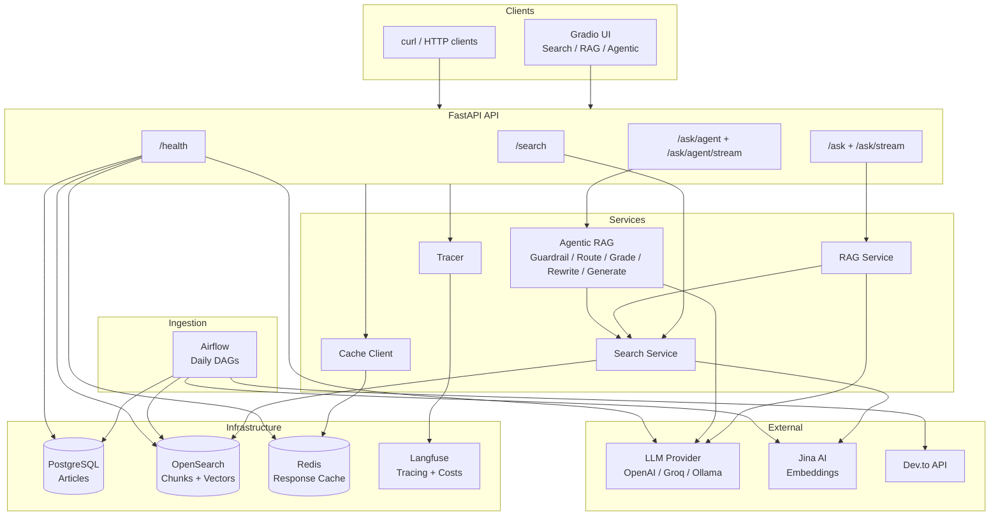

# Content RAG Platform

A production-ready Retrieval-Augmented Generation (RAG) platform for ingesting, indexing, and querying technical content from multiple sources using hybrid search (BM25 + vector embeddings).

## Features

- **Multi-source ingestion**: Dev.to articles (Stack Overflow, GitHub discussions planned)
- **Hybrid search**: BM25 keyword search + semantic vector embeddings with RRF ranking
- **RAG pipeline**: Streaming answers via SSE with configurable LLM provider (OpenAI, Groq, Ollama)
- **Observability**: Langfuse tracing with automatic span hierarchy and cost tracking
- **Caching**: Redis exact-match cache to avoid duplicate LLM calls
- **Airflow orchestration**: Scheduled daily ingestion with retry logic
- **Gradio UI**: Search and RAG tabs with real-time streaming
- **Production patterns**: Structured logging, exception handling, graceful degradation, CI/CD

## Quick Start

```bash
cp .env.example .env          # configure API keys
make build                    # build images (first time or after dependency changes)
make up-rag                   # start core + Gradio UI + Redis
```

## Make Targets

| Command | What it starts |
|---|---|
| `make up` | Core: API + Postgres + OpenSearch |
| `make up-rag` | Core + Gradio UI + Redis |
| `make up-rag-local` | Core + Gradio UI + Redis + Ollama |
| `make up-observability` | Core + Langfuse stack |
| `make up-airflow` | Core + Airflow |
| `make up-dashboards` | Core + OpenSearch Dashboards |
| `make down` | Stop all containers |
| `make down-volumes` | Stop all + delete volumes |
| `make test` | Run all tests (unit + api + integration) |
| `make test-smoke` | Run smoke tests (requires external services) |
| `make lint` | Run ruff linter |
| `make format` | Format code |

## Configuration

All configuration is via `.env`. See `.env.example` for all options.

**LLM Provider** (required for RAG):

```bash
LLM_PROVIDER=openai           # openai | groq | ollama
OPENAI__API_KEY=sk-...
```

**Langfuse** (optional, for tracing):

```bash
LANGFUSE__ENABLED=true
LANGFUSE__PUBLIC_KEY=pk-lf-rag-platform-dev
LANGFUSE__SECRET_KEY=sk-lf-rag-platform-dev
```

Keys are pre-seeded when using `make up-observability`. Dashboard at `localhost:3001` (admin@example.com / admin123).

## Architecture



### Ingestion (Airflow)

Articles fetched from Dev.to API, upserted into PostgreSQL, chunked and indexed into OpenSearch. Only new/updated articles are processed.

```
setup_environment --> fetch_and_store_articles --+--> index_articles --> generate_daily_report
                 \--> setup_opensearch_index ----+
```

### Search (OpenSearch)

Articles split into ~600-word overlapping chunks indexed for BM25 and vector search. Hybrid search combines both via Reciprocal Rank Fusion (RRF).

See [docs/opensearch.md](docs/opensearch.md) for index configuration.

### Query Modes

The platform offers three progressively intelligent ways to query content:

| Mode | Endpoint | Description |
|------|----------|-------------|
| **Search** | `POST /api/v1/search` | Direct hybrid search against the index. Returns ranked chunks. |
| **RAG** | `POST /api/v1/ask` | Search + LLM generation. Retrieves chunks and generates an answer. |
| **Agentic RAG** | `POST /api/v1/ask/agent` | Multi-step pipeline with guardrails, routing, grading, and retry. |

### Agentic RAG Flow

```
question
    |
    v
[GUARDRAIL] -- out of scope --> "I can only answer questions about software development."
    |
    v (in scope)
[ROUTE] -- decides tags, search mode, chunk count
    |
    v
[RETRIEVE] -- calls SearchService
    |
    v
[GRADE] -- LLM evaluates each chunk for relevance
    |                           |
    v (relevant)                v (irrelevant, retries < 2)
[GENERATE]                  [REWRITE QUERY] --> back to RETRIEVE
    |
    v
  response (answer + sources + reasoning steps)
```

Each node is an LLM call with structured JSON output. The orchestrator coordinates the flow as a simple state machine with conditional routing and retry logic.

```bash
curl -X POST http://localhost:8000/api/v1/ask/agent \
  -H "Content-Type: application/json" \
  -d '{"question": "What are the best practices for error handling in Python?"}'
```

### RAG (Linear)

```bash
curl -X POST http://localhost:8000/api/v1/ask \
  -H "Content-Type: application/json" \
  -d '{"question": "What are the best practices for error handling in Python?", "tags": ["python"]}'
```

Streaming endpoint (`/api/v1/ask/stream`) uses Server-Sent Events for real-time token delivery.

### Graceful Degradation

| Component | Missing | Behaviour |
|---|---|---|
| Postgres | App won't start | Required |
| OpenSearch | Search/RAG returns 502 | Required |
| LLM provider | RAG returns 502, search still works | Required for RAG |
| Jina embeddings | Hybrid/vector search unavailable, BM25 works | Optional |
| Redis | No caching, every request hits LLM | Optional |
| Langfuse | No tracing, decorators no-op | Optional |
| Gradio | No UI, API works via curl | Optional |

## Future Enhancements

### Prompt Management
- Prompt versioning with CRUD admin API (stored in Postgres, audited)
- Active/draft/archived lifecycle per prompt
- Rollback to previous versions without redeployment
- Per-prompt metrics via Langfuse (which version performed better)

### Evaluation and A/B Testing
- DeepEval integration for automated RAG quality scoring (faithfulness, relevance, coherence)
- A/B testing of prompt versions, search configurations, and chunking strategies
- Evaluation datasets stored in Postgres, results tracked in Langfuse

### Database and Migrations
- Alembic for schema versioning and migrations
- Init container pattern for zero-downtime deployments

### Additional Data Sources
- Stack Overflow Q&A ingestion pipeline
- GitHub discussions ingestion pipeline
- Source-aware routing in the agentic pipeline (agent decides which index to query)

### Infrastructure
- API rate limiting with slowapi + Redis backend
- Semantic caching (embedding-based similarity for near-duplicate queries)
- React frontend with proper auth, session management, and conversation history

### Agentic Extensions
- Tool-use patterns (agent can call external APIs, run code, etc.)
- Multi-agent orchestration (specialist agents for different domains)
- Conversation memory (multi-turn context within a session)
